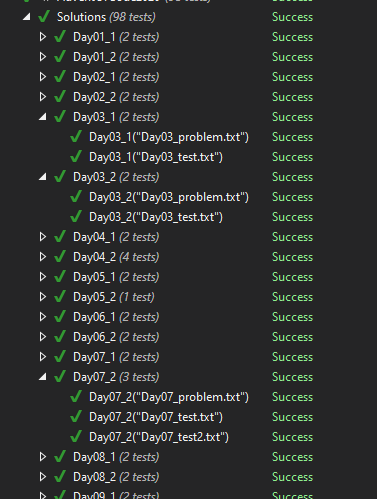

# Advent of code 2020

Here are my solutions for [Advent of code 2020](https://adventofcode.com/2020/) using `C#`. I managed to solve all the days in December except [day 20](https://adventofcode.com/2020/day/20), which I still hope to solve.

### Code organization
I decided to use Unit tests and unit tests runner for debugging/running the solutions. It is very convenient to run and debug in Visual studio, especially with R# :). 

For running each day's solutions I created 2 parameterized tests, like `Day18_1` and `Day18_2`. As a parameter, I am using file names where I storing input from the puzzle's text and target input.

